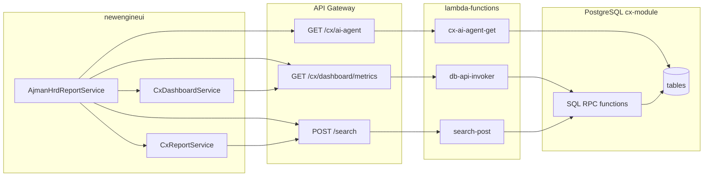

# Ajman HRD Reporting APIs — Implementation Plan

## Scope

**Frontend routes** ([`newengineui/src/app/app.routes.ts`](newengineui/src/app/app.routes.ts)):

| Route | Component | Purpose |
|-------|-----------|---------|
| `/addons-ajman-hrd/reporting` | [`reporting.component.ts`](newengineui/src/app/pages/addons-ajman-hrd/reporting/reporting.component.ts) | Monitoring KPI cards |
| `/addons-ajman-hrd/sessions` | [`total-sessions.component.ts`](newengineui/src/app/pages/addons-ajman-hrd/total-sessions/total-sessions.component.ts) | Session volume chart + summary cards |
| `/addons-ajman-hrd/inquiries` | [`inquiries.component.ts`](newengineui/src/app/pages/addons-ajman-hrd/inquiries/inquiries.component.ts) | Multi-report hub (5 inquiry types) |
| `/addons-ajman-hrd/definationMethods` | [`definationMethod.component.ts`](newengineui/src/app/pages/addons-ajman-hrd/definationMethods/definationMethod.component.ts) | Static metric definitions (no live data) |

**Filter scope (per your choice):** Reuse the same `channel_filter`, `account_filter`, and date range as existing CX (`CxDashboardService` / `CxReportService` BehaviorSubjects).

**Summaries (per your choice):** Interim derivation from `chat_message_analysis` + `chatbot_sessions` + `channels` until a dedicated summaries table exists.

---

## Architecture (reuse existing proxy pattern)



No new Lambda functions are required for most work: extend **SQL migrations** + register new `resourceType` entries in [`search-post/index.js`](new-engine-core%202/lambda-functions/search-post/index.js) (and optionally one new `GET` route in [`db-api-invoker/index.js`](new-engine-core%202/lambda-functions/db-api-invoker/index.js) if a non-paginated aggregate is cleaner).

---

## Page-by-page API inventory

### 1. Reporting (monitoring dashboard)

**UI data** ([`reporting.component.ts`](newengineui/src/app/pages/addons-ajman-hrd/reporting/reporting.component.ts)):

| Card | Static field | Data source |
|------|--------------|-------------|
| استفسارات غير مشمولة | `value`, `changePct` | `analysis_other_count` from dashboard metrics; WoW from two date-range calls |
| اجمالي الجلسات | `value`, trend | `total_session_count` (or `message_session_count` if “active” sessions preferred — align with CX Sessions report: use `message_session_count`) |
| اجمالي المستخدمين | `value`, trend | **NEW:** `COUNT(DISTINCT vendor_client_id)` on `chatbot_sessions` |
| متوسط مدة الجلسة | `4:32` format | `active_session_time_sum / message_session_count` from dashboard metrics; format with existing [`formatDurationCompact`](newengineui/src/app/shared/utils/time.utils.ts) |

**APIs:**

- **Reuse:** `GET /cx/dashboard/metrics` → `cx_dashboard_metrics_group_get` ([`16_cx_dashboard_metrics_group_get.sql`](new-engine-core%202/lambda-functions/_cloudformation-scripts/migration-postgresql/migrations-scripts/cx-module/2.%20Functions/16_cx_dashboard_metrics_group_get.sql))
- **Extend RPC:** Add `distinct_user_count BIGINT` to `cx_dashboard_metrics_group_get` (daily grain, summed carefully when aggregating — use `COUNT(DISTINCT vendor_client_id)` per day in SQL, then sum is wrong; better: add separate `cx_dashboard_summary_get` returning period totals including `distinct_user_count`, or compute distinct users in a companion RPC called once per filter set)
- **Comparison:** Two calls with current vs previous period (mirror [`fillEmptyDates`](newengineui/src/app/shared/utils/cx.utils.ts) + [`aggregateMetrics`](newengineui/src/app/shared/utils/cx.utils.ts)); compute `changePct` / `changeDir` in a small Ajman helper

**Tables:** `chatbot_sessions`, `chat_messages`, `chat_message_ratings`, `chat_session_ratings`, `chat_message_analysis` (all already joined in dashboard RPC).

**Session ending time dialog:** Not a reporting metric. **Reuse** `GET /cx/ai-agent` ([`cx-ai-agent-get`](new-engine-core%202/lambda-functions/cx-ai-agent-get)) for `idleSessionTTLInSeconds` for the channel’s linked agent. Persisting edits is out of scope unless product requires `PUT /cx/ai-agent` + Bedrock update (existing [`cx-ai-agent-put`](new-engine-core%202/lambda-functions/cx-ai-agent-put) only updates name today).

---

### 2. Total sessions (`/sessions`)

**UI data** ([`total-sessions.component.ts`](newengineui/src/app/pages/addons-ajman-hrd/total-sessions/total-sessions.component.ts)):

- 3 summary cards: total, average per period, peak
- ECharts line: weekly / monthly / yearly buckets, optional previous-period overlay

**APIs:**

- **Primary:** `GET /cx/dashboard/metrics` — daily rows already returned (`day`, `total_session_count`, …)
- **Frontend transform:** New helper `buildSessionsTimeseries(metrics, periodType, compareEnabled)`:
  - Weekly: bucket daily rows by ISO week labels (Arabic labels via Luxon locale)
  - Monthly / Yearly: group by month/year
  - Comparison: shift date range backward by same duration and merge series
- **Summary cards:** Derived from aggregated buckets (sum, mean, max) — no new API if daily metrics suffice

**Optional backend optimization (Phase 2):** `cx_dashboard_sessions_timeseries_get(p_granularity, …)` to offload grouping in SQL if payloads become large.

**Tables:** `chatbot_sessions` (via existing dashboard RPC).

---

### 3. Inquiries hub (`/inquiries`)

Fix **dropdown label mismatch** before integration (blocks `@if` branches):

| `inquiryOptions` value | Template `@if` today | Action |
|------------------------|----------------------|--------|
| `مؤشرات جودة التجربة ورضا المستفيدين` | `جودة التجربة ورضا المستفيدين` | Align strings |
| Others | Match | OK |

#### 3a. استفسارات غير مشمولة (default table)

**UI columns:** channel, time, classification, confidence, question

| UI field | DB mapping |
|----------|------------|
| question | `chat_message_analysis.question` |
| time | `created_at` |
| channel | `channels.name` |
| classification | `category` or `verdict` (document mapping: `verdict` → Arabic label; `category='other'` already filtered) |
| confidence | **Not in schema** — display `—` or hide column until column added |

**API — Reuse:** `POST /search` with `resourceType: "cx_report_other_questions"` ([`23_cx_report_other_questions_get.sql`](new-engine-core%202/lambda-functions/_cloudformation-scripts/migration-postgresql/migrations-scripts/cx-module/2.%20Functions/23_cx_report_other_questions_get.sql))

Wire via existing [`CxReportService.getReportOtherQuestions`](newengineui/src/app/data/api-services/cx-report.service.ts).

---

#### 3b. مؤشرات جودة التجربة ورضا المستفيدين

**Subcomponents:** [`quality-of-experience.component.ts`](newengineui/src/app/pages/addons-ajman-hrd/quality-of-experience/quality-of-experience.component.ts)

| UI block | Mapping |
|----------|---------|
| Volume: total / rated / unrated sessions | Dashboard: `message_session_count`, `chat_session_rating_count`, `message_session_count - chat_session_rating_count` |
| Avg duration (rated vs unrated) | **NEW RPC** or extend dashboard: avg `active_session_time` split by `chat_session_rating_count > 0` |
| Sentiment 3-way (positive/negative/neutral) | Map star ratings: 1–2 → negative, 3 → neutral, 4–5 → positive using `chat_session_rating_*_count` |
| Comparison chart (current vs previous) | Two dashboard calls + bucket aggregation |
| Satisfaction log table | **NEW:** `cx_report_session_satisfaction_get` — all ratings with `feedback_text`, `rating`, `channel_name`, `created_at` (existing `cx_report_sessions_feedbacks_get` only returns `rating <= 3`) |

**Tables:** `chatbot_sessions`, `chat_session_ratings`, `chat_session_feedbacks`, `channels`, `accounts`

---

#### 3c. تقييم جودة الاجابات

**Subcomponents:** [`answers-quality.component.ts`](newengineui/src/app/pages/addons-ajman-hrd/shared/components/answers-quality/answers-quality.component.ts)

| UI block | Mapping |
|----------|---------|
| 3 stat cards | Dashboard: `ai_response_message_count`, rated = up+down, unrated = neutral counts |
| Bar chart (positive/negative/neutral) | `total_upvote/downvote/neutral_message_count` |
| Ratings log (up/down, answer, channel, time) | **NEW:** `cx_report_message_ratings_get` — paginated list of AI messages with `chat_message_ratings.rating` + `chat_messages.content` |

**Tables:** `chat_messages`, `chat_message_ratings`, `chatbot_sessions`, `channels`

**Note:** Do not use `cx_report_messages_feedbacks` for this tab — it only returns downvotes and reports ([`17_cx_report_messages_feedbacks_get.sql`](new-engine-core%202/lambda-functions/_cloudformation-scripts/migration-postgresql/migrations-scripts/cx-module/2.%20Functions/17_cx_report_messages_feedbacks_get.sql)).

---

#### 3d. ملخصات المحادثات (interim)

**UI fields:** topic, path, summary, name, channel, time

**Interim RPC:** `cx_report_conversation_summaries_get` (new)

Proposed row shape from existing tables:

| Field | Interim source |
|-------|----------------|
| topic | `chat_message_analysis.category` (non-`other`) |
| summary | `chat_message_analysis.answer` (truncated) or last AI `chat_messages.content` |
| path | Join `chat_messages.sources` (text array) → comma-separated doc names |
| name | `accounts.account_name_en` or anonymized `vendor_client_id` prefix |
| channel | `channels.name` |
| time | `chat_message_analysis.created_at` |

Group by `session_id`, take latest analysis row per session in date range.

**Tables:** `chat_message_analysis`, `chatbot_sessions`, `chat_messages`, `channels`, `accounts`

**Future:** Replace with dedicated `chat_session_summaries` table when product adds persistence.

---

#### 3e. الأسئلة الشائعة

**Subcomponents:** [`frequently-asked-questions.component.ts`](newengineui/src/app/pages/addons-ajman-hrd/frequently-asked-questions/frequently-asked-questions.component.ts)

| UI block | API |
|----------|-----|
| Stat: total inquiries | Sum `user_input_message_count` from dashboard metrics OR count from analysis |
| Stat: top source | **NEW:** `cx_report_top_sources_get` — `UNNEST(chat_messages.sources)` grouped, top 1 |
| FAQ table (question, source, satisfaction%, count) | **NEW:** `cx_report_faq_questions_get` — group `chat_message_analysis` by `question`, pick dominant `sources[1]`, count frequency; satisfaction% from related upvote ratio if available |
| Category bar chart | **Reuse:** `cx_report_questions_categories` |
| Source bar chart | **NEW:** `cx_report_sources_frequency_get` |
| Compare mode | Two date-range queries |

**Tables:** `chat_message_analysis`, `chat_messages`, `chat_message_ratings`, `channels`

---

### 4. Definition methods (`/definationMethods`)

Static Arabic copy only — **no reporting API**. Optional later: CMS or config endpoint; out of scope for this pass.

---

## New / modified backend artifacts

### A. SQL migrations (`cx-module/2. Functions/`)

| Function | Purpose | Paginated |
|----------|---------|-----------|
| `cx_dashboard_metrics_group_get` (modify) | Add `distinct_user_count` per day OR add `cx_dashboard_period_summary_get` | No |
| `cx_report_message_ratings_get` + `_total_items_get` | Answers-quality log | Yes |
| `cx_report_session_satisfaction_get` + `_total_items_get` | QoE satisfaction log (all ratings) | Yes |
| `cx_report_conversation_summaries_get` + `_total_items_get` | Interim summaries | Yes |
| `cx_report_faq_questions_get` + `_total_items_get` | FAQ table | Yes |
| `cx_report_sources_frequency_get` + `_total_items_get` | FAQ source chart | Yes |
| `cx_report_top_sources_get` | Single-row “most used source” stat | No (or return via FAQ RPC) |

Follow existing signatures:

```sql
(channel_filter, account_filter, search_filter, p_start_date, p_end_date, p_page_size, p_page_number)
```

Reference: [`23_cx_report_other_questions_get.sql`](new-engine-core%202/lambda-functions/_cloudformation-scripts/migration-postgresql/migrations-scripts/cx-module/2.%20Functions/23_cx_report_other_questions_get.sql)

### B. `search-post` registration

Add to `RESOURCE_TYPE_TABLES` in [`search-post/index.js`](new-engine-core%202/lambda-functions/search-post/index.js):

```javascript
cx_report_message_ratings: 'rpc/cx_report_message_ratings_get',
cx_report_session_satisfaction: 'rpc/cx_report_session_satisfaction_get',
cx_report_conversation_summaries: 'rpc/cx_report_conversation_summaries_get',
cx_report_faq_questions: 'rpc/cx_report_faq_questions_get',
cx_report_sources_frequency: 'rpc/cx_report_sources_frequency_get',
```

### C. Optional `db-api-invoker` route

Only if needed for non-paginated summary:

- `GET /cx/dashboard/summary` → `rpc/cx_dashboard_period_summary_get`

Otherwise keep one `GET /cx/dashboard/metrics` + client aggregation.

### D. CloudFormation / API catalog

- Register new RPCs in PostgREST (existing migration deploy pipeline)
- Update [`api-gateway/list/api.js`](new-engine-core%202/api-gateway/list/api.js) if new REST paths added

---

## Frontend integration

### New service layer

Create [`newengineui/src/app/data/api-services/ajman-hrd-report.service.ts`](newengineui/src/app/data/api-services/ajman-hrd-report.service.ts):

- **Inject** `CxDashboardService` + `CxReportService` for filters (do not duplicate filter state)
- **Methods:**
  - `getMonitoringCards()` — dashboard metrics × 2 periods → `MonitoringStatCardData[]`
  - `getSessionsPage(filters)` — timeseries + cards
  - `getOtherQuestions(page)` — wraps `getReportOtherQuestions`
  - `getMessageRatings(page)`, `getSessionSatisfaction(page)`, `getConversationSummaries(page)`, `getFaqQuestions(page)`, `getSourcesFrequency(page)`
- **Models:** Add interfaces under `data/interfaces/ajman-hrd-report.interface.ts` + `parseDb` mappers (mirror [`cx-report.model.ts`](newengineui/src/app/data/models/cx-report.model.ts))

### Helpers

- [`newengineui/src/app/data/helpers/ajman-hrd-metrics.helpers.ts`](newengineui/src/app/data/helpers/ajman-hrd-metrics.helpers.ts) — WoW %, star-rating → 3 sentiment buckets, duration formatting
- Reuse [`aggregateMetrics`](newengineui/src/app/shared/utils/cx.utils.ts), [`fillEmptyDates`](newengineui/src/app/shared/utils/cx.utils.ts)

### Component wiring (replace static arrays)

| Component | Change |
|-----------|--------|
| `ReportingComponent` | `monitoringCards` from `ajmanHrdReportService.getMonitoringCards()` + `async` pipe |
| `TotalSessionsComponent` | Load metrics on `filtersChanged`; rebuild chart/cards |
| `InquiriesComponent` | Paginated tables per tab; pass `@Input()` stats to child components |
| `QualityOfExperienceComponent` | `@Input()` data or inject service |
| `AnswersQualityComponent` | `@Input() statsItems` from API; paginated `ratingsLogs` |
| `FrequentlyAskedQuestionsComponent` | Load FAQ + charts from API |
| `ConversationSummariesCardComponent` | Already `@Input() data` — parent loads API |

### Filters bar

[`filters-bar.component.ts`](newengineui/src/app/pages/addons-ajman-hrd/shared/components/filters-bar/filters-bar.component.ts) emits dates but does not connect to `CxDashboardService`. **Wire** `startDate`/`endDate` to `setDateRangeFilter()` and subscribe to `channelFilter$` / `accountFilter$` (add channel/account pickers if missing — can reuse CX header filter components from [`cx-dashboard-header`](newengineui/src/app/pages/cx/cx-dashboard/cx-dashboard-header)).

### CSV export

Client-side export from loaded page data (same pattern as [`cx-reports-container`](newengineui/src/app/pages/cx/cx-reports/cx-reports-container/cx-reports-container.component.ts) `exportToCsv`) — no new API.

---

## Data mapping reference (tables)

| Table | Used for |
|-------|----------|
| [`chatbot_sessions`](new-engine-core%202/lambda-functions/_cloudformation-scripts/migration-postgresql/migrations-scripts/cx-module/1.%20Tables/6_chatbot_sessions.sql) | Session counts, duration, distinct users (`vendor_client_id`), channel/account filters |
| [`chat_messages`](new-engine-core%202/lambda-functions/_cloudformation-scripts/migration-postgresql/migrations-scripts/cx-module/1.%20Tables/10_chat_messages.sql) | AI/client messages, `sources[]` for FAQ |
| [`chat_message_ratings`](new-engine-core%202/lambda-functions/_cloudformation-scripts/migration-postgresql/migrations-scripts/cx-module/1.%20Tables/12_chat_message_ratings.sql) | Answer quality thumbs up/down |
| [`chat_message_analysis`](new-engine-core%202/lambda-functions/_cloudformation-scripts/migration-postgresql/migrations-scripts/cx-module/1.%20Tables/29_chat_message_analysis.sql) | Categories, other questions, failed responses, interim summaries |
| [`chat_session_ratings`](new-engine-core%202/lambda-functions/_cloudformation-scripts/migration-postgresql/migrations-scripts/cx-module/1.%20Tables/15_chat_session_ratings.sql) | QoE star ratings (1–5) |
| [`chat_session_feedbacks`](new-engine-core%202/lambda-functions/_cloudformation-scripts/migration-postgresql/migrations-scripts/cx-module/1.%20Tables/14_chat_session_feedbacks.sql) | Satisfaction log comments |
| [`channels`](new-engine-core%202/lambda-functions/_cloudformation-scripts/migration-postgresql/migrations-scripts/cx-module/1.%20Tables/9_channels.sql) | Channel name in lists |
| `accounts` | Account name in lists |

---

## Implementation phases

### Phase 1 — Reuse existing APIs (no SQL)

1. Create `AjmanHrdReportService` + metrics helpers
2. Wire **Reporting** + **Total sessions** to `GET /cx/dashboard/metrics` (two-period comparison)
3. Wire **Other questions** tab to `cx_report_other_questions`
4. Wire **FAQ category chart** to `cx_report_questions_categories`
5. Fix inquiry dropdown string mismatches

### Phase 2 — New SQL + search-post types

1. Add RPCs: message ratings, session satisfaction, conversation summaries (interim), FAQ questions, sources frequency
2. Extend dashboard RPC for `distinct_user_count` (or period summary RPC)
3. Register all in `search-post`
4. Add frontend models + paginated tables

### Phase 3 — Child components + polish

1. Wire QoE, answers quality, FAQ, summaries components
2. Connect `filters-bar` to shared CX filter state
3. Session-ending dialog: load `idleSessionTTLInSeconds` via `cx-ai-agent` GET
4. CSV export buttons

### Phase 4 — Verification

1. Local: `db-api-invoker` events + `search-post` local-run-events (copy patterns from [`local-run-events/rpc.js`](new-engine-core%202/lambda-functions/search-post/local-run-events/rpc.js))
2. UI: verify each inquiry tab with real channel/account filters
3. Compare aggregates with existing **CX Reports** page for same date range (sanity check)

---

## Risks and decisions

| Item | Mitigation |
|------|------------|
| No `confidence` column | Show placeholder; add migration later if Lex scores are persisted |
| Interim summaries ≠ real conversation summaries | Label in UI as interim; plan `chat_session_summaries` table later |
| `distinct_user_count` across days | Use period-level RPC, not sum of daily distinct counts |
| `cx_report_sessions_feedbacks` filters `rating <= 3` | Do not reuse for Ajman QoE log; use new satisfaction RPC |
| Session TTL save | Read-only in v1 unless `cx-ai-agent-put` extended for `idleSessionTTLInSeconds` |

---

## Files to touch (summary)

**Backend:** `cx-module/2. Functions/*.sql`, [`search-post/index.js`](new-engine-core%202/lambda-functions/search-post/index.js), optionally [`db-api-invoker/index.js`](new-engine-core%202/lambda-functions/db-api-invoker/index.js)

**Frontend:** New `ajman-hrd-report.service.ts`, helpers, interfaces/models; update all components under [`addons-ajman-hrd/`](newengineui/src/app/pages/addons-ajman-hrd/); reuse [`cx-dashboard.service.ts`](newengineui/src/app/data/api-services/cx-dashboard.service.ts) / [`cx-report.service.ts`](newengineui/src/app/data/api-services/cx-report.service.ts)

**Reference implementation:** [`cx-reports-container.component.ts`](newengineui/src/app/pages/cx/cx-reports/cx-reports-container/cx-reports-container.component.ts) + [`cx-dashboard-container.component.ts`](newengineui/src/app/pages/cx/cx-dashboard/cx-dashboard-container/cx-dashboard-container.component.ts)
